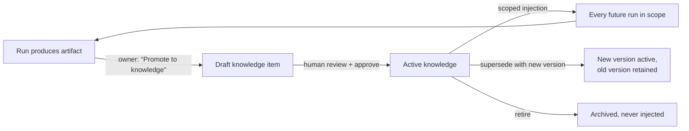

# Company Knowledge — Design (Sprint 6, implementation deliberately deferred)

> Status: **design only.** Per executive direction (2026-07-24): "Begin
> designing Company Knowledge as a first-class organizational asset, but
> don't rush implementation until the executive workflow feels complete."
> Builds on [KNOWLEDGE.md](KNOWLEDGE.md) (the conceptual spec, D-011); this
> document makes it buildable. Related: [OBJECTIVES.md](OBJECTIVES.md),
> [ONBOARDING.md](ONBOARDING.md), DECISIONS.md D-011/D-015.

## 1. Purpose

Knowledge is what makes the Hub compound: every run should start smarter
than the last, because the company remembers. Work completes and closes;
knowledge persists and governs (D-011). Today the platform has knowledge's
seed — `project_context_items`, human-approved, injected into every prompt —
but no lifecycle: no versioning, no scoping below "project", no way for work
products to become knowledge, and no way to see what the company knows.

## 2. The core loop (the product, in one diagram)



Two invariants carry over unchanged:
- **Humans gate the loop.** Nothing a model writes becomes knowledge without
  an explicit approval (the same posture as actions and context today).
  Model-proposed knowledge lands as `draft`, exactly like `pending` context.
- **Knowledge is versioned, never edited.** A change is a new version with
  `supersedes` lineage; injection always uses the newest active version.
  (History model matches the audit philosophy without the append-only
  trigger — old versions are readable, not gone.)

## 3. Data model (additive; no changes to existing tables)

```
knowledge_items
  id, org_id, project_id (nullable — null = org-wide)
  scope        enum: org | project | department | employee
  department_id (nullable FK), agent_id (nullable FK)   -- scope pointers
  kind         enum: standard | policy | decision | playbook |
               persona | template | brand | fact
  title, body  (markdown, size-capped)
  version      int, supersedes uuid (nullable, self-FK)
  status       enum: draft | active | archived
  source       enum: manual | promoted_artifact | promoted_context
  source_ref   uuid (nullable — artifact/context item it came from)
  created_by, approved_by, approved_at
  timestamps
```

- RLS: same tenant predicate as everything else; org-scoped rows
  (`project_id is null`) readable by org members — **the one deliberate
  relaxation of I1**, reviewed in §6.
- `project_context_items` migrates in as `kind: fact, scope: project`
  (its `approved` → `active`); the table is then retired. One migration,
  zero behavior change on day one.

## 4. Injection model (what the engine sees)

`loadApprovedContext()` generalizes to `loadKnowledge(ctx, agent)`:

1. Scope resolution, most specific wins on title collision:
   employee(agent) → department(agent's) → project → org.
2. Budget: injection is capped (~4k tokens by default, per-workspace
   setting). Items carry a priority; overflow drops lowest-priority items and
   the run records *which* knowledge was included (`run_steps` detail) — so
   "what did the employee know?" is always answerable.
3. Wrapping: unchanged `<untrusted-context>` discipline (T2). Knowledge is
   still data, never instructions.

## 5. Surfaces (executive-first, matching the Sprint 6 posture)

- **Knowledge page per workspace** (nav: "Knowledge"): list by kind, active/
  draft/archived filters, version history per item, diff view between
  versions. Plain-language framing: "What your team knows."
- **Promote from results**: on any artifact or consolidated result — one
  button: "Save as company knowledge" → pre-filled draft → approve. This is
  the habit loop's entry point and the first thing to build.
- **Draft queue on the briefing**: model-proposed knowledge shows up beside
  approvals — decisions of a second kind, same morning ritual.
- **Employee cards**: "Knows: N items" with a link — makes the compounding
  visible where the workforce lives.

## 6. Trust boundary review

- Org-wide knowledge crosses workspace lines *by explicit human choice only*
  (creating org-scope requires org owner/admin and shows a visible "visible
  to all workspaces" warning). Default scope is always `project`. I1 stays
  the default; org scope is an opt-in, audited exception.
- Promotion is the new injection-adjacent surface: a poisoned artifact
  promoted to knowledge would influence future prompts. Controls: human
  approval (as today), draft-state quarantine, and the knowledge-included
  record on every run (traceability). Same rigor as project context now.
- No new execution paths. Knowledge changes what models *read*, never what
  they can *do*.

## 7. Phasing (when the executive workflow feels complete)

| Phase | Contents | Size |
|---|---|---|
| K1 | Schema + migrate `project_context_items` in + Knowledge page (list/create/approve/archive, project scope only) | ~1 sprint, with room |
| K2 | Promote-from-result + briefing draft queue + versioning UI | small |
| K3 | Department/employee scoping + injection budget + "what did it know" record | small |
| K4 | Org-wide scope (the I1 exception, with its warnings) | deliberate, last |

Ready to schedule whenever you call the executive workflow done — K1 has no
open design questions left.

## 8. Success measures

Adoption: knowledge items per active workspace; % of runs injecting ≥1 item
beyond the charter. Value: review-intervention rate on runs *with* vs
*without* knowledge (the compounding claim, measured). Hygiene: median age
since last version bump on active items (stale knowledge is worse than
none).
