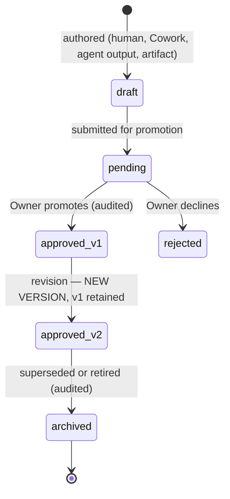

# Knowledge — The Permanent Memory Layer

> **Status: SPECIFICATION.** Concept and future schema only; no implementation
> in this sprint. Origin: CTO review 2026-07-23, recorded as
> [DECISIONS.md](DECISIONS.md) D-011.

## Purpose

Defines the platform's second pillar. The hub models **Work** superbly
(objectives → tasks → runs → immutable messages). This document specifies
**Knowledge**: the durable, versioned, human-curated truth that governs work —
so that every AI consults what the project *knows* before doing what the
project *wants*.

## Scope

Concept, taxonomy, lifecycle, retrieval contract, and recommended future
schema. Excludes: implementation, embedding/search technology choices
(decision record required at build time), and cross-project knowledge — which
is **forbidden permanently** ([MISSION.md](MISSION.md) value 2; invariant I1
applies to knowledge exactly as to everything else).

## Definitions

| Term | Meaning |
|---|---|
| **Knowledge item** | A versioned, per-project document of a declared kind that agents consult. |
| **Kind** | The taxonomy slot: `architecture_decision`, `business_rule`, `coding_standard`, `brand_guideline`, `customer_persona`, `product_decision`, `playbook`, `template`, `policy`. |
| **Promotion** | The only way content becomes knowledge: a human approves it in. Work artifacts, model output, and Cowork drafts are *candidates*, never knowledge by default. |
| **Consultation** | The engine-side step that loads relevant approved knowledge into a run's context, before the model sees the brief. |

## Work vs. Knowledge — the boundary

| | Work | Knowledge |
|---|---|---|
| Lifecycle | happens, completes | persists, evolves |
| Mutability | immutable record (I7) | versioned — new versions, old ones kept |
| Examples | task, run, message, artifact | coding standard, persona, playbook |
| Enters prompts | as the brief | as consulted context, wrapped untrusted |
| Created by | anyone/anything | drafted by anyone; **exists only via human promotion** |
| Today's seed | `tasks`…`messages` | `project_context_items` (the embryo of this layer) |

The promotion rule settles every boundary dispute: *an artifact is work until
a human promotes it — then a knowledge item cites the artifact as its source.*

## Relationship to what exists today

`project_context_items` already implements the kernel: per-project, quarantine
(`pending`) by default, only `approved` enters prompts, loaded by the
highest-scrutiny read in the system (`loadApprovedContext`,
[ARCHITECTURE.md](ARCHITECTURE.md) §7). The Knowledge layer is that kernel
grown up: kinds, versioning, provenance, and scoped consultation — an
**evolution of the existing table, not a parallel system** (D-011).

## Lifecycle



- Versions are append-only: editing an approved item creates the next version;
  history is never rewritten (the audit philosophy, applied to memory).
- Every version records provenance: author (human/agent/plugin principal),
  source artifact or conversation if any, promotion decision + approver.
- Archival removes an item from consultation, never from history.

## The consultation contract

When Knowledge ships, the run engine's context-loading step becomes:

1. Load this project's approved knowledge relevant to the task — selected by
   kind defaults per department ([AGENT_CATALOG.md](AGENT_CATALOG.md) — e.g.,
   Engineering agents always get `coding_standard` + `architecture_decision`;
   Marketing gets `brand_guideline` + `customer_persona`), plus task-level
   pins.
2. Enforce a **knowledge budget** (token cap per run) with priority order:
   pinned items → department defaults → recency. Overflow is reported, never
   silently truncated.
3. Wrap every item as untrusted content, exactly as context items are wrapped
   today — knowledge is curated, **not trusted as instructions** (I3 —
   knowledge governs *what the model knows*, never *what the platform does*).
4. Record which knowledge versions were consulted on the run (`run_steps`
   linkage) — so any output can be traced to the exact knowledge it saw.

## Ownership

- **Owner:** promotes, revises, archives; owns the taxonomy's contents.
- **Coordinator:** flags stale knowledge (e.g., a playbook older than the
  system it describes), proposes promotions from completed work.
- **Agents:** consult; may *draft* candidates (which land as `pending`); never
  promote. Same authority ceiling as everywhere else ([TEAM.md](TEAM.md)).

## Recommended future schema (additive; a later sprint)

```
knowledge_items
  id uuid PK · org_id · project_id                      (D-008 conventions, RLS as standard)
  kind knowledge_kind enum (9 kinds above)
  slug text (unique per project) · title text
  current_version int · status: active|archived
  created_by → profiles · timestamps

knowledge_versions
  id uuid PK · org_id · project_id
  item_id → knowledge_items (cascade) · version int (UNIQUE(item_id, version))
  content text · change_note text
  source_artifact_id → artifacts NULL · authored_by_principal text
  promoted_by → profiles · promoted_at timestamptz
  (append-only: UPDATE/DELETE blocked by trigger, like messages)

run_knowledge_consultations
  run_id → runs · knowledge_version_id → knowledge_versions
  (which knowledge each run actually saw)

migration note: project_context_items rows become knowledge_items of a
default kind with version 1 — no data loss, one-way, scripted.
```

## Examples

- The five workspace charters seeded today → become `business_rule` knowledge
  items v1 on migration.
- Claude Code finishes a tricky refactor and writes up the pattern → artifact
  (work). The Owner promotes it → `coding_standard` v1 citing the artifact.
  Future engineering runs in that project consult it automatically.
- A marketing agent drafts a persona from a research task → `pending`
  `customer_persona`; until promoted, no run ever sees it.
- *Rejected by design:* "sync brand guidelines from AccurateBids to the other
  four workspaces" — cross-project knowledge is forbidden; the owner promotes
  per-project copies deliberately if they want them.

## Future considerations

- Retrieval sophistication (search, embeddings) is deliberately unspecified —
  start with kind+pin selection; add retrieval only when knowledge volume
  demands it (simplicity gate, D-013).
- Templates (`template` kind) likely gain variable substitution — spec at
  build time.
- Plugin-provided knowledge (e.g., a style-checker shipping a rulebook) would
  arrive as `pending` items via the manifest — [PLUGIN_SDK.md](PLUGIN_SDK.md)
  capability vocabulary already covers it.

## Related documents

[DECISIONS.md](DECISIONS.md) D-011/D-013 · [OBJECTIVES.md](OBJECTIVES.md)
(the Work pillar's spec) · [MISSION.md](MISSION.md) · [TEAM.md](TEAM.md) ·
[AGENT_CATALOG.md](AGENT_CATALOG.md) · [ARCHITECTURE.md](ARCHITECTURE.md) §7 ·
[HANDOFF.md](HANDOFF.md) §5
