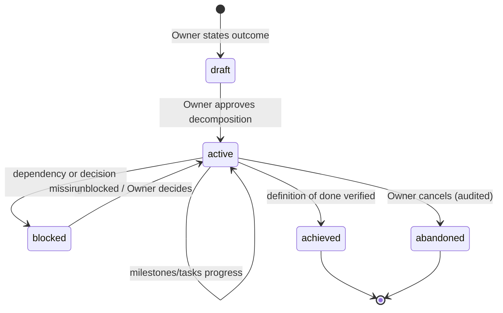

# Objectives — Work as a First-Class Business Concept

## Purpose

Elevates *why work happens* into the platform. Today the hub tracks tasks,
runs, and approvals; it does not know what business outcome a task serves.
This document defines the Objective model — concept, lifecycle, ownership,
priorities, dependencies, reporting — and recommends (without implementing)
the schema additions a future sprint needs.

## Scope

Business/product specification only. **No database changes in this sprint** —
§Schema is a recommendation for a future engineering sprint, constrained to be
purely additive to the existing schema ([HANDOFF.md](HANDOFF.md) §5).

## Definitions and hierarchy

```
Objective        "Grow AccurateBids conversion 20% this quarter"   (weeks–months)
  └─ Milestone   "New pricing page live"                           (days–weeks)
      └─ Task    "Rewrite pricing FAQ"                             (minutes–hours)   ← exists today
          └─ Run       one engine execution                                          ← exists today
              └─ Artifact   durable output(s)                                        ← exists today
              └─ Approval   held consequential action(s)                             ← exists today
                  └─ Completion   task → milestone → objective rollup
```

| Concept | Cardinality | Owner (role) | Exists today? |
|---|---|---|---|
| Objective | many per project, **never cross-project** (I1) | Human Owner | No — this spec |
| Milestone | ordered set per objective | Coordinator (Owner approves) | No — this spec |
| Task | many per milestone (or standalone) | Coordinator/Owner | **Yes** (`tasks`) |
| Run | 0..n per task | Engine | **Yes** (`runs`) |
| Artifact | 0..n per run/task | Engine/agents | **Yes** (`artifacts`) |
| Approval | 0..n per task | **Human Owner only** | **Yes** (`approvals`) |

## Lifecycle



Rules:

1. An objective's **definition of done is a checkable claim**, not a vibe —
   same standard as [ROADMAP.md](ROADMAP.md) exit criteria.
2. **Milestones complete only by verification**, not by task-count: all tasks
   done *and* the milestone's own criterion checked.
3. **Completion rolls up, never down** — closing an objective never
   auto-closes tasks; abandonment requires an audited Owner decision listing
   orphaned work.
4. Objectives are **tenant-scoped like everything else**: an objective in
   AccurateBids can never reference KodiScan work (invariant I1 applies
   unchanged).

## Ownership

- **Owner** creates/approves objectives, sets priority and budget expectation,
  declares achieved/abandoned.
- **Coordinator** ([TEAM.md](TEAM.md)) proposes decomposition, sequences
  milestones, keeps status current, reports drift.
- **Agents** never see the objective tree directly — tasks remain their entire
  world. (Context minimization: an agent gets its brief and approved context,
  nothing more.)

## Priorities

Single ordinal priority per objective within a project (1 = highest, unique).
Milestones inherit their objective's priority; tasks inherit their milestone's.
Two forcing functions:

- The Coordinator sequences work strictly by priority unless the Owner
  overrides (which is itself a priority edit, audited).
- Budget pressure resolves by priority: when a project nears its spend limit
  ([MISSION.md](MISSION.md) principle 4), lowest-priority work pauses first —
  the platform's budget gate stays the hard stop.

## Dependencies

- Allowed: milestone → milestone within one objective; objective → objective
  within one project. Declared, visible, and acyclic (reject cycles at
  creation).
- Forbidden: any cross-project dependency (would create a covert channel
  across tenants — I1 again).
- A blocked item names its blocker; the Coordinator surfaces "blocked > 48 h"
  in reporting.

## Reporting

Rollup views this model unlocks (per project, per period):

- **Objective progress:** milestones done / total, tasks done / total, blocked
  items with age.
- **Cost per objective:** sum of `usage_events` through the task linkage —
  exact micros, so "what did this outcome cost?" gets a real answer
  (extends the existing Usage screen, [HANDOFF.md](HANDOFF.md) §7).
- **Approval friction:** proposals per objective, decision latency, expiry
  rate.
- **Review value:** revise/reject rate per objective — where the adversarial
  review is earning its keep ([PRODUCT_VISION.md](PRODUCT_VISION.md)
  advantage 1).

## Schema — recommended additions (FUTURE SPRINT; do not implement now)

Purely additive; no existing table changes except one nullable column on
`tasks`. All new tables follow the standing conventions: `org_id` +
`project_id` NOT NULL (D-008), RLS single-table predicate, timestamps, enums
as Postgres enums.

```
objectives
  id uuid PK · org_id · project_id
  title text · outcome text (definition of done)
  status objective_status enum: draft|active|blocked|achieved|abandoned
  priority int  (unique per project among non-terminal)
  budget_expectation_micros bigint null
  created_by → profiles · timestamps

milestones
  id uuid PK · org_id · project_id
  objective_id → objectives (cascade)
  title text · exit_criterion text
  status milestone_status enum: pending|active|blocked|done
  position int (unique per objective) · timestamps

objective_dependencies
  id uuid PK · org_id · project_id
  from_objective_id / to_objective_id → objectives
  CHECK (from != to) · UNIQUE(from,to)
  (acyclicity enforced at application layer on insert)

tasks
  + milestone_id uuid NULL → milestones (set null)   ← only change to an existing table
```

Notes for the implementing sprint: audit events `objective.created/…`,
`milestone.completed` etc. through the existing `writeAudit`; rollup queries
need no new storage (derivable); RLS policy block in `rls.sql` extends the
existing loop list; tenancy test list in `tenancy.test.ts` §"every tenant
table" gains the two new tables.

## Examples

- **Good objective:** "AccurateBids: publish the reworked pricing page —
  done when the new page is live and the old URL redirects." Checkable, single
  project, has a natural milestone split (copy approved → PR approved →
  deployed [Phase 3 executor]).
- **Bad objective:** "Make all my businesses better with AI" — not checkable,
  cross-project (violates the model), undecomposable. The Coordinator's job is
  to bounce this back as five per-project objectives.
- **Dependency in action:** "StressPro launch announcement" (objective B)
  depends on "StressPro beta stable" (objective A) — B's tasks stay `pending`
  while A is `active`; the report shows B blocked-on-A rather than silently idle.

## Future considerations

- **Cross-objective agents [far future]:** a Coordinator product surface could
  propose decompositions automatically — proposals would follow the same
  quarantine pattern as context items (pending until Owner approval).
- **Budget envelopes per objective** (soft allocation within the project's
  hard cap) — useful for agencies attributing spend per client deliverable.
- **Objective templates** for repeatable work (e.g., "launch checklist") once
  patterns emerge from real usage.

## Related documents

[WORKFLOW.md](WORKFLOW.md) · [TEAM.md](TEAM.md) · [MISSION.md](MISSION.md)
(success metrics feed from these rollups) · [HANDOFF.md](HANDOFF.md) §5 ·
[ARCHITECTURE.md](ARCHITECTURE.md) §8 · [DECISIONS.md](DECISIONS.md) D-008
