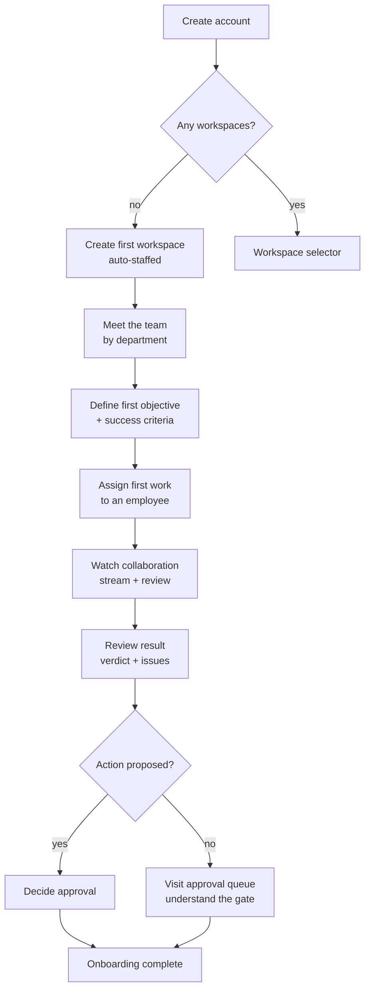

# ONBOARDING.md — First-Time User Journey (Design Specification)

> **Status: design specification only — nothing here is implemented.**
> Sprint 3 M4 deliverable per the Executive Decisions (2026-07-23, item 6) and
> the workforce direction (D-015). Implementation is scheduled with the
> Objectives UI (Sprint 4) and Workforce UX (Sprint 5) — they are the same
> screens.

## Purpose

Define the complete journey from "never seen the product" to "approved my
first AI-proposed action" — in under fifteen minutes. This document is the
contract the implementing sprints build against, written in workforce
vocabulary from the start so no screen has to be re-skinned later.

## Scope

Covers: account creation → workspace → meeting the team → first objective →
first assignment → watching the work → reviewing the result → deciding an
approval. Excludes: billing/plans (deferred by executive decision), multi-user
invitations (single-owner phase), MCP/integrations (Phase 5+).

## Definitions

| Term | Meaning (existing mechanism) |
|---|---|
| Workspace | A project — hard isolation boundary (I1) |
| Employee | A configured agent: role + department + provider/model resolved per D-014/D-015 |
| Department | Org-level grouping of employees (`departments` table) |
| Objective | The unit of business intent (`objectives`, dark until Sprint 4) |
| Assignment | Submitting work to an employee — creates a task + run |
| Review | The cross-vendor second opinion (D-005), rendered as verdict + issues |
| Approval | The human gate on any consequential action (I4) |

## The fifteen-minute journey

Target wall-clock per stage (cumulative 13 min, 2 min slack):

| # | Stage | Target | The user feels |
|---|---|---|---|
| 1 | Create account | 1 min | "That was ordinary" (good — no novelty tax at the door) |
| 2 | First workspace | 2 min | "This is *my* company's space" |
| 3 | Meet the team | 2 min | "I have staff, organized by department, and I get who does what" |
| 4 | First objective | 2 min | "It asked me what I'm trying to *achieve*, not what model to call" |
| 5 | First assignment | 1 min | "I delegated, like to a person" |
| 6 | Watch the work | 3 min | "They're working — and checking each other — in front of me" |
| 7 | Review the result | 1 min | "I can see what the reviewer caught" |
| 8 | Decide an approval | 1 min | "Nothing happens unless I say so" — the trust moment |

### Stage detail and design rules

**1. Create account.** Existing login screen (segmented Sign in / Create
account). No survey, no wizard-before-value. On first sign-in with zero
workspaces → route to Stage 2 instead of the empty selector.

**2. First workspace.** One field (name) + optional description. On create,
the platform provisions silently: default employees (per seed roster),
default budget ($25/mo unless changed), charter context item. Copy speaks
outcome: *"Your workspace comes staffed — meet your team next."* Never shown:
provider names, model ids, tier mechanics.

**3. Meet the team.** The workspace's employees grouped by department, each a
card: name, role title, department badge, one-line responsibility, and a
"seniority available" hint (the D-014 flagship tier, presented as *senior
staff for complex work*). The provider logo appears ONLY here, small, as
provenance ("intelligence supplied by…"), never as a choice. Rule: **the
platform never asks "which model?" — it asks "who should do this?"**

**4. First objective.** Prompt: *"What are you trying to achieve in this
workspace?"* Fields: title, optional 1–3 success criteria (label + target,
`source: manual`). A "skip for now" path exists but is visually secondary —
the objective-first framing (D-010) is the product's spine, and onboarding is
where the habit forms. Template chips seeded per workspace name (e.g. "Ship
v1", "Grow to 100 users", "Cut support load 20%").

**5. First assignment.** From the objective: *"Assign your first piece of
work."* Assignee picker = employee cards (Stage 3), defaulting to the
objective's sponsoring department's lead. Brief = one textarea. Review
defaults ON with copy: *"A second employee from a rival intelligence vendor
will check this work"* — the differentiator stated in workforce language.
Under the hood: createTask with tier=standard; cross-vendor pairing per
D-005; nothing new.

**6. Watch the work.** The existing SSE stream (M2), presented as
collaboration: employee card lights up → text streams → reviewer card lights
up → verdict chip lands. If the reviewer raises issues and a revision runs,
the timeline says so in plain words: *"Lead Engineer is addressing the
Reviewer's 2 issues."* Failure states render as employee-status, honestly:
*"OpenAI is rate-limiting; retrying (2 of 3)."*

**7. Review the result.** Consolidated result on top; the Review panel
(verdict + severity-tagged issues) directly beneath; full transcript
collapsed below. One instructional sentence, once: *"Everything here is
permanent record — nothing your team says can be edited or deleted."*

**8. Decide an approval.** The first run's task should naturally propose an
action (the template briefs are written to elicit one, e.g. "draft and
propose saving a PROJECT_PLAN.md"). The approval card shows: what, proposed
by whom, full payload, expiry. Approving (or rejecting) completes onboarding.
If the model proposed nothing, the empty approval queue still gets visited
with copy explaining the gate. Rule: **never fabricate a fake approval for
theater — the first approval must be real.**

### Journey diagram

## Instrumentation (build with the feature, not after)

Per-stage timestamps on the existing audit trail (`onboarding.stage_reached`
events) — measuring the 15-minute promise is one query. Funnel drop-off per
stage is the Workforce UX sprint's first product metric.

## Examples

A worked example flows through the doc above using a fictional workspace
("BushAndBelly: Ship the summer lookbook") in the implementing sprint's
Figma/wireframes — deliberately not specified here; copy tone and rules are
this document's contract, pixels are not.

## Future considerations

- Multi-user: Stage 3 becomes "meet the team / invite humans" when multi-user
  lands; the department grouping already accommodates human members.
- Knowledge: Stage 4 gains "anything your team should know first?" (seeding
  `project_context_items` → Knowledge system when it lands).
- Templates: workspace archetypes (product studio, agency, research lab)
  pre-shaping departments and employee rosters.

## Related documents

[DESIGN-REVIEW-WORKFORCE.md](DESIGN-REVIEW-WORKFORCE.md) · DECISIONS.md
D-010/D-012/D-014/D-015 · [OBJECTIVES.md](OBJECTIVES.md) ·
[AGENT_CATALOG.md](AGENT_CATALOG.md) · [WORKFLOW.md](WORKFLOW.md) ·
[USER_JOURNEY.md](USER_JOURNEY.md) (pre-workforce journey doc this spec
supersedes for onboarding specifically) · [ROADMAP.md](ROADMAP.md)
