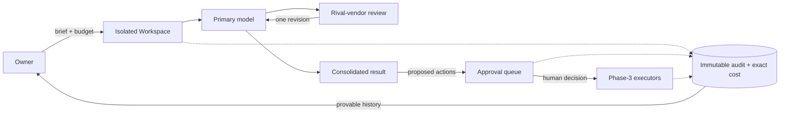

# Product Vision — King AI Operations Hub

## Purpose

Defines what we are building commercially, for whom, against whom, and how the
product evolves over 3–5 years — grounded in the mission
([MISSION.md](MISSION.md)) and constrained by the architecture that already
exists ([ARCHITECTURE.md](ARCHITECTURE.md)).

## Scope

Market-facing product definition. Engineering sequencing stays in
[ROADMAP.md](ROADMAP.md); this document must never contradict it — where the
two speak of the same phase, ROADMAP.md is authoritative on *what ships when*,
this document on *why it matters to a customer*.

## Definitions

| Term | Meaning |
|---|---|
| **Portfolio owner** | A person or small team running multiple distinct ventures/products simultaneously. |
| **Adversarial review** | The cross-vendor review workflow: OpenAI work checked by Anthropic and vice versa (D-005). |
| **Sovereign delegation** | Handing work to AI while retaining physically-enforced approval over anything consequential. |
| **Control plane** | The single UI + audit surface through which all AI work in a portfolio is run and governed. |

## Product overview

King AI Operations Hub is a **governed multi-agent operations platform**: one
place to delegate work to frontier models from competing vendors, with each
workspace hermetically isolated, every output adversarially reviewed, every
dollar metered before it is spent, and every consequential action held for
human approval behind an immutable audit trail.

One sentence: *the control plane that makes AI delegation safe enough to run a
business on.*

## Target customers

In adoption order:

1. **Solo portfolio owners** *(now — the founder is customer zero)*
   Builders running 2–10 ventures (like the five seeded workspaces:
   AccurateBids, KodiScan, BushAndBelly, StressPro, PartsHunt Pro). Pain:
   context bleed between ventures, no cost control, no memory per venture.
2. **Product studios & agencies** *(platform phase)*
   5–50 people doing client work with AI. Pain: client confidentiality
   (isolation is a contract term, not a preference), billable cost attribution
   per client, proof-of-process when a client asks "who wrote this?"
3. **Regulated and audit-sensitive teams** *(later platform phase)*
   Legal, finance, healthcare-adjacent teams who cannot adopt AI without an
   evidence trail. Pain: their compliance function currently says "no" because
   no tool can show who approved what. Our audit chain and approval gates are
   the unlock.

Explicit non-customers: consumers wanting a chatbot; enterprises wanting
fully-autonomous agent fleets (excluded by [MISSION.md](MISSION.md) "never"
list); teams wanting to train models on their corpus.

## Problems being solved

| Problem | Today's reality | Our answer |
|---|---|---|
| Context bleed | One ChatGPT/Claude account mixes every venture's secrets | RLS-enforced workspaces; approved-context-only prompts (I1) |
| Unverified output | Users paste model output into production on vibes | Structural adversarial review with verdicts and one bounded revision |
| Cost opacity | Bill arrives at month-end | Pre-flight budget gate, per-task micro-cent attribution (I8, D-004) |
| AI with hands | Agents that can act are agents that can be prompt-injected into acting | Proposal-only model + human approval queue + (Phase 3) hash-verified executors |
| No institutional memory | Chat history is a junk drawer | Curated, per-project approved context items with quarantine for anything model-proposed |
| No accountability trail | "The AI did it" | Immutable messages + hash-chained audit log (I6, I7) |

## Competitive advantages

1. **Cross-vendor adversarial review as a first-class primitive.** Competitors
   orchestrate one vendor or treat multi-model as a dropdown. We make vendor
   disagreement the quality mechanism, structurally (D-005). Hard to copy
   credibly for anyone strategically tied to a single vendor.
2. **Sovereignty by construction.** "Human in the loop" is usually a checkbox;
   here there is *no execution path* absent approval (T2). This is auditable by
   a customer's security team in an afternoon — a sales asset, not a slide.
3. **Bank-grade history.** Append-only, hash-chained, per-tenant audit — the
   feature regulated buyers are told to demand and cannot find.
4. **Exact economics.** Integer-micro cost accounting with versioned pricing —
   enables true per-client/per-venture P&L attribution.
5. **Boring, verifiable claims.** Every marketing claim above maps to a named
   invariant with a test. Diligence-proof positioning.

## Market positioning

- **Against agent frameworks** (LangChain/LangGraph, CrewAI, AutoGen): they are
  libraries for builders; we are a governed *operations product* for owners.
  "They help you build agents; we help you *run a business* on them."
- **Against single-vendor consoles** (ChatGPT Team/Projects, Claude
  Projects/Cowork): excellent single-vendor UX, but structurally unable to offer
  cross-vendor review or vendor-neutral governance — and workspace isolation is
  organizational, not contractual/auditable.
- **Against internal-tools/RPA suites**: they automate deterministic flows; we
  govern non-deterministic workers, which is a different trust problem.

Position statement: *"For portfolio operators who must trust AI output, King AI
Operations Hub is the governed delegation platform whose competing-vendor
review, sealed workspaces, and approval-gated actions make AI work
provable — unlike agent frameworks and vendor consoles, which optimize for
capability without accountability."*

## Example use cases

1. **Venture triage (today, real):** Owner asks the AccurateBids workspace for
   a pricing-page rewrite. GPT-5.2 drafts; Claude Opus reviews (`revise`: two
   factual issues); GPT revises; owner reads the consolidated result with the
   review attached; the proposed `git_pr` action sits in the approval queue
   until the owner approves. Total cost visible: $0.41.
2. **Client-confidential agency work (platform):** An agency runs each client
   as a workspace. Client A's brand guidelines can never surface in Client B's
   prompt — provable via the tenancy test and audit log when Client A's
   security team asks.
3. **Regulated memo drafting (platform):** A finance team drafts an investor
   memo; both vendors' models sign off through review; the audit chain shows
   every draft, verdict, and the named human who approved release
   (`social_publish` action type).
4. **Cost-governed research sweep (after Phase 5 MCP):** An external MCP client
   submits 20 research tasks across workspaces; each is budget-gated per
   workspace and lands in the same approval queue — no bypass (ROADMAP Phase 5).

## Product evolution — 3 to 5 years

Phases 1–6 below the line are engineering-sequenced in
[ROADMAP.md](ROADMAP.md); years are product framing on top of them.

- **Year 1 — Prove it on ourselves.** Phases 2–4: observable review, executors
  behind approvals, artifacts. The five ventures run measurably on the hub.
  Exit: metrics in [MISSION.md](MISSION.md) tracked for two consecutive quarters.
- **Year 2 — First external owners.** Hosted deployment, onboarding under 15
  minutes, Phase 5 MCP server, billing on top of usage accounting (margin on
  governed spend). Design partners from customer segment 1.
- **Year 3 — Teams.** Multi-human orgs: role-aware approvals (which human may
  approve which action class), delegation policies, [TEAM.md](TEAM.md)
  org concepts productized. Segment 2 (studios/agencies) becomes primary.
- **Years 4–5 — The governed integration ecosystem.** [PLUGIN_SDK.md](PLUGIN_SDK.md)
  opens provider/tool integration to third parties under our security bar;
  Objectives ([OBJECTIVES.md](OBJECTIVES.md)) make the hub the system of record
  for *work*, not just tasks. Segment 3 (regulated) unlocked by compliance
  packaging of what already exists (audit chain, approvals, isolation).

What does **not** change across all five years: the "never" list in
[MISSION.md](MISSION.md).

## Diagram — value flow

## Future considerations

- Pricing model (subscription vs. margin-on-spend vs. both) is deliberately
  undecided — an owner decision flagged in the Sprint report, not assumed here.
- "Bring your own keys" vs. platform-held keys for external customers changes
  the trust story and unit economics; revisit when Year-2 work begins.
- Single-owner language in [SECURITY.md](SECURITY.md) §7 will need a
  multi-tenant update at Year-2 — tracked as a documented tension, not a
  contradiction (schema and adversary model A3 already assume multi-user).

## Related documents

[MISSION.md](MISSION.md) · [ROADMAP.md](ROADMAP.md) · [TEAM.md](TEAM.md) ·
[OBJECTIVES.md](OBJECTIVES.md) · [PLUGIN_SDK.md](PLUGIN_SDK.md) ·
[ARCHITECTURE.md](ARCHITECTURE.md) · [HANDOFF.md](HANDOFF.md)
