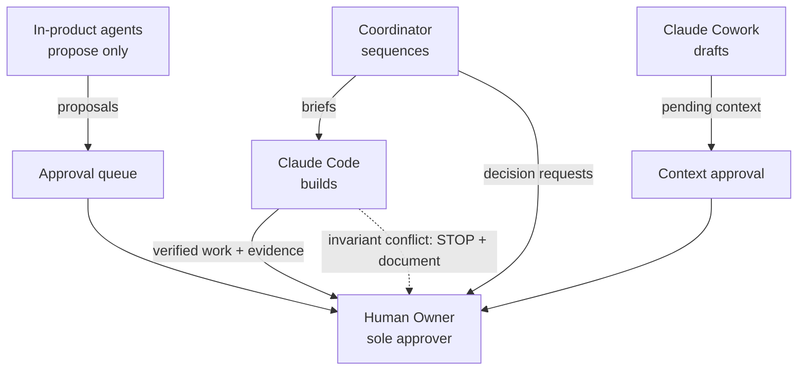

# Team — The AI Organization of King AI Operations Hub

## Purpose

Defines the human and AI roles that build and operate the platform: who decides,
who approves, who escalates to whom, and how work changes hands. This is the
organizational counterpart to [ARCHITECTURE.md](ARCHITECTURE.md)'s technical
boundaries.

## Scope

Covers the **development organization** (the roles building the platform) and
the **in-product agents** (the roles running inside it). Detailed per-agent
specifications live in [AGENT_CATALOG.md](AGENT_CATALOG.md); this document
covers authority and interaction, not configuration.

A hard rule inherited from [MISSION.md](MISSION.md): **no role below Human
Owner ever holds approval authority over consequential actions.** Every rule in
this document is subordinate to that.

## Definitions

| Term | Meaning |
|---|---|
| **Decision authority** | The right to choose among options within one's scope without asking. |
| **Approval authority** | The right to authorize a consequential action (closed enum, [SECURITY.md](SECURITY.md) §4). Only humans hold it. |
| **Escalation** | Moving a blocked or out-of-scope matter up the authority chain with context attached. |
| **Handoff** | Transferring work between roles with a written artifact, never verbally/implicitly. |

## Roles and responsibilities

### 1. Human Owner (the founder; later: each customer's accountable human)

- **Responsibilities:** sets mission and priorities; owns all credentials and
  spend ceilings; decides everything in the "Outstanding questions" class
  (deployment, pricing, model defaults); is the *only* approver of
  consequential actions; performs actions the AI organization is prohibited
  from (account creation, entering credentials, payments).
- **Decision authority:** unlimited within the platform.
- **Approval authority:** exclusive, today. (Future multi-human orgs: see
  Future considerations.)
- **Communication expectations:** approval-queue items answered inside their
  24 h expiry; owner decisions requested by other roles answered or explicitly
  deferred — a deferred decision is a decision to keep the current default.

### 2. Coordinator *(role — currently performed by Claude Code inside each working session; a persistent product surface for it arrives with [OBJECTIVES.md](OBJECTIVES.md))*

- **Responsibilities:** translates Owner objectives into milestones and tasks;
  sequences work; tracks state across sessions via the repo's documents
  ([HANDOFF.md](HANDOFF.md) is its memory); assembles reports
  (sprint reports, this documentation set); routes each task to the right
  executor role.
- **Decision authority:** ordering and decomposition of work; may not change
  scope, spend, or architecture invariants.
- **Approval authority:** none.
- **Escalates when:** two objectives conflict; a task requires an owner-only
  decision; any invariant of [ARCHITECTURE.md](ARCHITECTURE.md) §2 would be
  touched.

### 3. Claude Code (engineering agent — builds the platform)

- **Responsibilities:** implements features, tests, migrations, and docs;
  keeps the quality gate green; performs honest verification (never reports
  untested work as done); maintains the decision log
  ([DECISIONS.md](DECISIONS.md)) and handoff docs.
- **Decision authority:** implementation detail within existing architecture
  and decisions D-001…D-009; may propose new decisions but records them for
  review.
- **Approval authority:** none. Git commits/pushes, deployments, and
  destructive operations require explicit Owner instruction per session —
  the platform's own approval rules mirror this deliberately.
- **Escalates when:** a requirement contradicts an invariant or a decision
  record; a security-relevant ambiguity appears; credentials would be needed.

### 4. Claude Cowork (operations/document agent — desktop-side assistant)

- **Responsibilities:** owner-side operational work *around* the platform:
  drafting business documents, preparing summaries, file management, research
  briefs that may become approved context items.
- **Decision authority:** formatting and drafting choices.
- **Approval authority:** none. Anything Cowork produces that should become
  project memory enters as a `pending` context item — quarantined until the
  Owner approves it, same as model-proposed content
  ([HANDOFF.md](HANDOFF.md) §5, `project_context_items`).
- **Escalates when:** asked to touch the repository (Claude Code's domain) or
  platform data directly.

### 5. OpenAI Reviewer (in-product agent role)

- **Responsibilities:** adversarial review of Anthropic-primary responses using
  the verdict protocol (`approve | revise | reject`) defined in
  [HANDOFF.md](HANDOFF.md) §15; surfacing correctness, completeness, and
  safety issues.
- **Decision authority:** verdict choice only. A verdict shapes the workflow's
  next step (one revision at most, D-006) but never triggers execution.
- **Approval authority:** none — a reviewer `approve` verdict is a *quality*
  signal, categorically distinct from a human approval.
- **Symmetry:** the Anthropic Reviewer role is identical with vendors swapped;
  cross-vendor pairing is structural (D-005).

### 6. Future specialized agents *(catalogued, not yet built — see [AGENT_CATALOG.md](AGENT_CATALOG.md) §Future)*

Research Agent, Artifact Generator, Cost Auditor, Executor Agents (Phase 3),
MCP Client Agents (Phase 5). Each enters service only with a catalog entry
defining purpose, permissions, and escalation *before* first run — an agent
without a catalog entry does not run.

## Authority matrix

| Capability | Owner | Coordinator | Claude Code | Claude Cowork | In-product agents |
|---|---|---|---|---|---|
| Set objectives & priorities | **Decide** | Propose | Propose | — | — |
| Decompose into milestones/tasks | Approve | **Decide** | Propose | — | — |
| Implementation detail | — | — | **Decide** | — | — |
| Draft business/ops documents | Approve | Assign | — | **Decide** (drafts) | — |
| Add to project memory (context) | **Approve** | Propose | Propose | Propose (pending) | Propose (pending) |
| Review verdicts | — | — | — | — | **Decide** (verdict only) |
| Consequential actions (commit, deploy, email, spend, delete…) | **Sole approver** | Request | Request | Request | Propose only |
| Change architecture invariants / security model | **Approve** | — | Propose w/ decision record | — | — |
| Credentials & payments | **Sole actor** | — | — | — | — |

## Escalation rules

1. **Invariant conflict → stop work, escalate to Owner** with the contradiction
   documented (what, why, recommended resolution) — never resolved silently.
   (This mirrors the sprint constraint: document, explain, recommend, don't implement.)
2. **Budget/limit hit → automatic halt** (the platform enforces this: budget
   gate, rate limits, run deadline). The role reports the halt; only the Owner
   raises a limit.
3. **Ambiguous instruction with risk asymmetry → assume the safe reading**,
   state the assumption, and proceed on everything unaffected; block only if
   every reading is unsafe.
4. **Cross-role dispute** (e.g., Coordinator sequencing vs. Claude Code
   feasibility) → the role with implementation authority states costs, the
   Coordinator re-sequences; if scope must change, Owner decides.
5. **Security-relevant surprise** (leaked value, tenancy anomaly, injection
   attempt observed) → immediate Owner notification + audit event; work in the
   affected area pauses.

## Handoff procedures

- **Session-to-session (same role):** [HANDOFF.md](HANDOFF.md) is the living
  handoff artifact; it must be current before a working session ends. Sprint
  reports snapshot state at review points.
- **Coordinator → Claude Code:** a task is handed off as a written brief:
  objective link, acceptance criteria, constraints, and named invariants it may
  not touch. No brief, no build.
- **Claude Code → Owner:** completed work is handed off with verification
  evidence (gate output, test counts, screenshots/logs) — claims of "done"
  without evidence are invalid by convention.
- **Cowork → platform:** documents intended as project memory are submitted as
  `pending` context items; the Owner's approval is the handoff.
- **In-product (agent → agent):** primary→reviewer→revision handoffs are
  automated inside the run state machine and recorded as immutable messages —
  the handoff artifact *is* the message row.

## Communication expectations

- Reports lead with state, not narrative: what changed, what's verified, what's
  blocked, what's needed.
- Every request to the Owner is decision-shaped: options, recommendation,
  consequence of deferral.
- Bad news travels first: failed gates, missed assumptions, and security
  anomalies are reported before any other content.
- All roles write for the next reader with zero context (the HANDOFF.md
  standard).

## Diagram — escalation and handoff flow

## Examples

- Claude Code discovers a requested feature needs cross-workspace search →
  names the violated value ([MISSION.md](MISSION.md) "never" #2), stops that
  part, delivers the per-workspace variant, escalates the scope question. ✔️
- The OpenAI Reviewer returns `approve` on a draft containing a proposed
  `deployment` action → the action still sits in the queue; reviewer approval
  is not human approval. ✔️
- Cowork drafts market research and pushes it directly into a prompt → ✖️
  prohibited; it must enter as a pending context item first.

## Future considerations

- **Departments (adopted — D-012):** agents organize into stable departments
  (Engineering, Marketing, Finance, Support, Operations); see the department
  table in [AGENT_CATALOG.md](AGENT_CATALOG.md). Departments give permissions
  and knowledge defaults a natural scope and give the Coordinator its routing
  structure.
- **Multi-human orgs (Year 3, [PRODUCT_VISION.md](PRODUCT_VISION.md)):**
  approval authority becomes role-scoped per action class (e.g., an org admin
  may approve `email_send` but not `deployment`). Schema already carries
  org/project roles; the policy layer is future work.
- **Persistent Coordinator:** when Objectives ship, the Coordinator role gains
  a product surface (objective/milestone state) instead of living purely in
  session context.
- **Agent identity:** future agents should authenticate as distinct principals
  (per-agent tokens, Phase 5) so the audit log attributes actions to the agent
  *instance*, not just the vendor.

## Related documents

[AGENT_CATALOG.md](AGENT_CATALOG.md) · [WORKFLOW.md](WORKFLOW.md) ·
[MISSION.md](MISSION.md) · [SECURITY.md](SECURITY.md) §4–5 ·
[HANDOFF.md](HANDOFF.md) · [DECISIONS.md](DECISIONS.md) D-005/D-006
