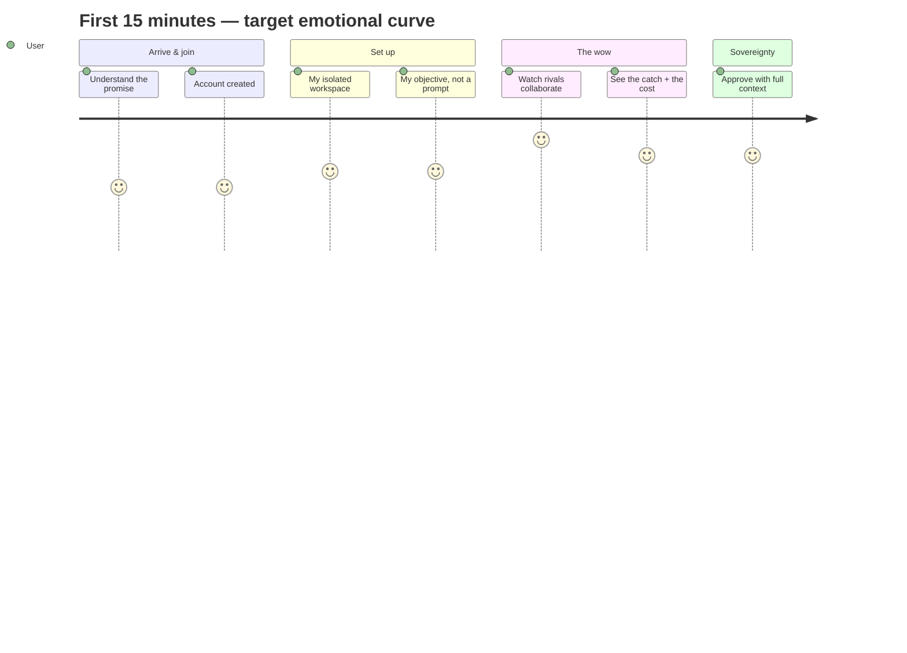

# User Journey — The First Fifteen Minutes

> **Status: DESIGN SPECIFICATION.** Origin: CTO review 2026-07-23 — "design the
> complete first-time user journey before major implementation continues."
> This document is the product-design contract the next UI sprints build
> against. It changes no current behavior.

## Purpose

Defines the complete first-time experience: a brand-new user goes from nothing
to *watching two rival AIs collaborate on their real work and approving the
result* — in under fifteen minutes. This journey is a competitive advantage in
itself ([PRODUCT_VISION.md](PRODUCT_VISION.md)): competitors demo capability;
we demo *governed* capability, fast.

## Scope

The journey from landing to first approved result, with per-step time budgets,
emotional beats, current gaps, and acceptance criteria. Excludes: visual
design, pricing/billing flows (undecided — [SPRINT-02-REPORT.md](SPRINT-02-REPORT.md)
§5), and team-member invitations (Year 3).

## Definitions

| Term | Meaning |
|---|---|
| **TTFW** | Time to First Wow — landing until the user watches the cross-vendor review happen on *their* brief. Target: ≤ 10 min. |
| **TTFA** | Time to First Approval — landing until the user approves/rejects their first proposed action. Target: ≤ 15 min. |
| **Golden path** | The single, opinionated default route below. Every fork is deferred, not offered, on first run. |

## The journey (golden path)

Total budget: **15:00**. Each step lists its budget, what the user does, what
the system does, and the emotional beat the step must land.

### Step 0 — Arrive (0:00–1:00)
**User:** lands on the product page/login. **System:** one screen, one promise
("Delegate work to rival AIs that check each other. Nothing happens without
you."), one button. **Beat:** *"I understand what this is in one sentence."*
**Gap today:** login page exists; no product framing for a stranger. *(build:
landing copy — small)*

### Step 1 — Create an account (1:00–2:30)
**User:** email + password, in. **System:** Supabase auth; auto-linked profile
(exists today). **Beat:** *frictionless.* **Gaps today:** the sign-up toggle is
easy to miss (observed with our own first user — the founder); email
confirmation settings can dead-end a new user. *(build: prominent sign-up,
confirmation-state handling — small, already queued in Sprint 3)*

### Step 2 — Create a workspace (2:30–4:00)
**User:** names their venture ("My SaaS"), one optional line about it.
**System:** creates project + membership + default agents + spend limit +
charter knowledge item **self-serve**. **Beat:** *"this is MY isolated room"* —
the isolation promise stated right here, at creation. **Gap today — the
biggest one:** workspaces exist only via the seed script; there is **no
create-workspace UI**. *(build: workspace-creation flow reusing seed logic —
medium; the golden-path blocker)*

### Step 3 — Define the first objective (4:00–6:00)
**User:** answers one question: *"What are you trying to get done?"* — free
text ("Launch my pricing page"). **System:** records it as the first
**Objective** (D-010) and suggests the first task toward it; until the
Objectives schema ships, the UI frames the task screen with this outcome text.
**Beat:** *"it asked me about my goal, not about prompts."* **Gap today:**
task-first UI; objective framing absent. *(build: objective-framed intake —
small now [text framing], full with A8 schema)*

### Step 4 — Submit work (6:00–7:30)
**User:** confirms the suggested first task or writes their own brief; provider
defaults to **Both** + review on (the differentiator IS the default). **System:**
task created; run starts immediately on the golden path (no separate click for
first-time users). **Beat:** *"that was one form."* **Gap today:** create→run
is two deliberate steps (D-009 stands for the API; the first-run UI should
chain them automatically). *(build: auto-run on first task — small)*

### Step 5 — Watch AI collaborate (7:30–11:00) ← the Wow
**User:** watches live: GPT-5.2 drafting → Claude Opus 4.8 reviewing with a
verdict → revision if demanded → consolidated result with the review attached.
**System:** streaming steps with clear stage labels and running cost. **Beat:**
*"one AI just caught the other's mistake, in front of me."* This moment is the
product. **Gap today:** no streaming — silence until completion (Sprint 3
deliverable, already scoped). *(build: SSE streaming + staged progress UI —
medium, scoped)*

### Step 6 — Review the result (11:00–13:00)
**User:** reads the consolidated answer; sees verdict, what changed after
review, and exact cost ("$0.31"). **System:** result view (exists) + review
panel (Sprint 3 structured verdicts). **Beat:** *"I can see why I should trust
this — and what it cost me."*

### Step 7 — Approve an action (13:00–15:00)
**User:** the run proposed one safe, real action (golden path ensures the
first brief tends to produce one — e.g., "save this as a project document" →
artifact/knowledge candidate); user opens the approval, sees the full payload,
approves. **System:** approval queue (exists); on approval, the recorded
decision — and, post-Phase 3, the execution. **Beat:** *"nothing happens
without me — and approving took ten seconds."* **Gap today:** approval queue
exists and works; what's missing is guaranteeing the first task yields a
meaningful, safe proposal. *(build: golden-path brief templates — small)*

## Gap summary (build order for the golden path)

| # | Gap | Size | Where scoped |
|---|---|---|---|
| 1 | Workspace-creation UI (self-serve) | Medium | **new — the blocker** |
| 2 | Streaming run view | Medium | Sprint 3 (scoped) |
| 3 | Objective-framed intake (text-level now) | Small | new |
| 4 | First-task auto-run + brief templates | Small | new |
| 5 | Sign-up prominence + confirmation handling | Small | Sprint 3 (queued) |
| 6 | Landing framing for strangers | Small | new |
| 7 | Structured review panel | Medium | Sprint 3 (scoped) |

Items 1, 3, 4, 6 constitute a coherent future sprint: **"Golden Path"** —
recommended to follow Sprint 3 ("Prove It Live"), so the wow moment exists
before the path leading strangers to it.

## Acceptance criteria (measured, not vibed)

- A tester with **no prior exposure** completes Steps 0–7 unaided in ≤ 15:00
  (stopwatch; think-aloud protocol), with TTFW ≤ 10:00.
- Zero moments where the tester asks "what is it doing?" during a run
  (streaming + stage labels close this).
- The tester can answer, unprompted, all three: *"Was your data isolated?
  Who checked the AI's work? Could it have done anything without you?"* —
  correctly. If they can't, the journey failed even if they finished.
- No step requires documentation, tooltips count as part of the product.

## Future considerations

- **Day-2 journey** (return visit: objective progress, pending approvals
  front-and-center) — spec after golden path ships.
- **Empty-state teaching:** each screen's empty state teaches its concept
  (approvals empty state explains sovereignty) — cheap, high-leverage.
- **Onboarding for segment 2/3 customers** (agencies: client-workspace
  templates; regulated: audit-tour mode) — Year 2–3, per
  [PRODUCT_VISION.md](PRODUCT_VISION.md).

## Related documents

[PRODUCT_VISION.md](PRODUCT_VISION.md) · [MISSION.md](MISSION.md) (principles
8–9 govern this design) · [OBJECTIVES.md](OBJECTIVES.md) ·
[WORKFLOW.md](WORKFLOW.md) · [DECISIONS.md](DECISIONS.md) D-009/D-010/D-013 ·
[SPRINT-02-REPORT.md](SPRINT-02-REPORT.md) §9 (Sprint 3 scope)
