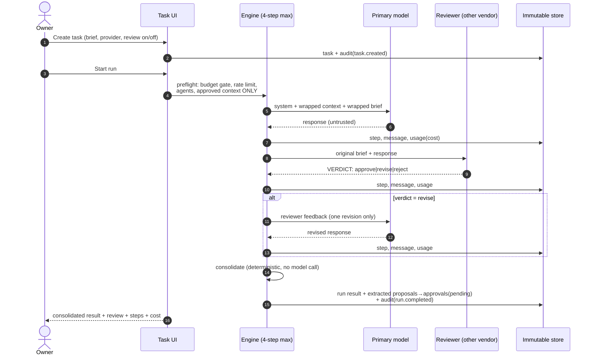
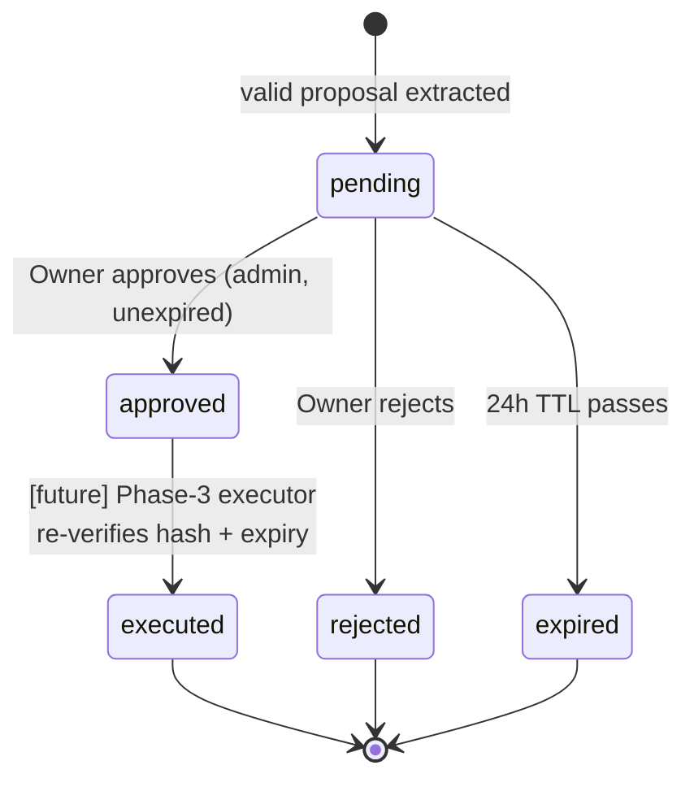

# Workflow — The Complete Lifecycle of Work

## Purpose

Documents how work moves through King AI Operations Hub end to end: from an
Owner objective down to an executed, audited, completed action. It unifies the
*business* lifecycle (objectives → milestones → tasks, see
[OBJECTIVES.md](OBJECTIVES.md)) with the *technical* run lifecycle already
implemented ([ARCHITECTURE.md](ARCHITECTURE.md) §6, §9).

## Scope

Describes lifecycle stages, states, and transitions. Where a stage is already
implemented, this document references the implementation rather than
re-specifying it. Where a stage is future (Objectives, Executors), it is
marked **[future]** and constrained by the existing architecture.

## Definitions

| Term | State machine home | Meaning |
|---|---|---|
| **Objective** [future] | [OBJECTIVES.md](OBJECTIVES.md) | A business outcome the Owner wants (weeks–months). |
| **Milestone** [future] | [OBJECTIVES.md](OBJECTIVES.md) | A checkable slice of an objective (days–weeks). |
| **Task** | `tasks` table | One brief handed to agents (minutes–hours). Statuses: `pending → running → awaiting_approval \| completed \| failed \| cancelled`. |
| **Run** | `runs` + `run_steps` | One execution of the 4-step engine for a task. |
| **Review** | `run_steps.kind='review'` | The rival vendor's verdict on the primary output. |
| **Artifact** | `artifacts` table | A durable output (text today; files in Phase 4). |
| **Approval** | `approvals` table | A held consequential action awaiting a human decision. |
| **Completion** | derived | Task completed + all its approvals decided (or expired) + artifacts stored. |

## The lifecycle, stage by stage

### 1. Objectives **[future — concept defined now, schema in a later sprint]**

The Owner states an outcome ("Ship AccurateBids v2 pricing page"). The
Coordinator ([TEAM.md](TEAM.md)) decomposes it into milestones with the Owner's
sign-off. Objectives carry priority, budget expectation, and a definition of
done. Until the schema lands, objectives live in this repo's documents.

### 2. Milestones **[future]**

Each milestone is a checkable claim ("New pricing page approved and merged"),
owning an ordered set of tasks. A milestone completes only when its tasks
complete *and* its exit criterion is verified — mirroring how
[ROADMAP.md](ROADMAP.md) phases work today.

### 3. Tasks *(implemented)*

Created via the New Task screen (Zod-validated; title, brief, provider
selection, review toggle). Creation writes the task record and an audit event;
the run is a deliberate second action (D-009). Only this project's approved
context will accompany the brief (I1).

### 4. Runs and Reviews *(implemented)*

The fixed engine: primary → review (other vendor) → at most one revision →
deterministic consolidation. Every step persists immediately (a crash cannot
un-spend money or lose messages). Verdict protocol and prompts:
[HANDOFF.md](HANDOFF.md) §15.

### 5. Approvals *(implemented: queue + decision; execution is Phase 3)*

Valid proposed actions (closed enum, Zod-parsed, ≤5, hash-stamped) become
`pending` approvals with a 24 h expiry. The Owner reviews the full payload and
approves or rejects with an optional note; project-admin role required; every
decision is audited. **Nothing executes today** — approval is a recorded
decision awaiting Phase 3 executors, which will re-read the row and re-verify
the payload hash before acting ([ROADMAP.md](ROADMAP.md) Phase 3).

### 6. Artifacts *(implemented for text; files in Phase 4)*

Durable outputs are stored with sha-256 checksum and size, linked to their task
and run. Phase 4 adds blob storage with per-project prefixes and signed URLs.

### 7. Completion and reporting

A task is *done* when its status is `completed` (no proposals) or when
`awaiting_approval` resolves via decisions/expiry. Milestone/objective rollups
are **[future]** ([OBJECTIVES.md](OBJECTIVES.md) §Reporting); today the
Dashboard, Usage, and Audit screens are the reporting surface: what ran, what
it cost, who approved what.

## End-to-end example (concrete, current build)

1. Owner opens **accuratebids**, creates task "Rewrite pricing FAQ" with
   provider `both` (⇒ review forced on).
2. Run: GPT-5.2 drafts (2 314 tokens, $0.19) → Claude Opus 4.8 reviews:
   `revise` — "two claims unsupported" → GPT-5.2 revises → consolidation shows
   final text + review summary.
3. The draft proposed `git_pr` "Open PR updating /pricing" — it appears in the
   Approval queue with full payload and hash; the task shows `awaiting_approval`.
4. Owner approves with note "ship it" → recorded, audited; (Phase 3 will turn
   this into an actual PR; today the decision itself is the deliverable).
5. Usage screen shows the task's exact spend; Audit shows the chain:
   `task.created → run.started → approval.requested → approval.decided`.

## Milestones and reviews of the *development* workflow

The same shape governs how the platform itself is built (dogfooding the
philosophy): ROADMAP phases = milestones; each ends in a written sprint report
(e.g., [SPRINT-01-REPORT.md](SPRINT-01-REPORT.md)) with quality-gate evidence;
the Owner's approval of that report is the phase gate. Escalation and handoff
rules: [TEAM.md](TEAM.md).

## Future considerations

- **Streaming (Sprint 2):** stage 4 gains live progress; no lifecycle change.
- **Queue-backed runs (A1):** stage 4's trigger becomes an enqueue; states
  unchanged (D-009 anticipated this).
- **Objective schema (future sprint):** see the recommended additions in
  [OBJECTIVES.md](OBJECTIVES.md) §Schema — no changes to existing tables.
- **Executor rollback records (Phase 3):** `executed` state gains a paired
  rollback artifact.

## Related documents

[OBJECTIVES.md](OBJECTIVES.md) · [TEAM.md](TEAM.md) ·
[ARCHITECTURE.md](ARCHITECTURE.md) §6/§9 · [SECURITY.md](SECURITY.md) §4 ·
[ROADMAP.md](ROADMAP.md) · [HANDOFF.md](HANDOFF.md) §15
